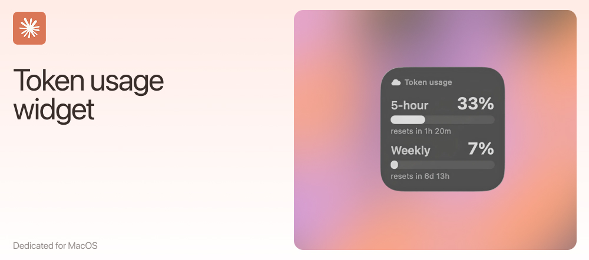

# Claude Usage Widget (macOS)



A native macOS **desktop widget** that shows your Claude subscription usage — your
**5-hour session** window and your **weekly** window — right on the desktop, next
to Battery and Weather.

It reads the usage numbers Claude Code already has access to (via the OAuth token
in your Keychain) and draws them as two simple bars with live reset countdowns.

## What it shows

- **5-hour session** — % of your rolling 5-hour limit used, and a countdown to reset.
- **Weekly** — % of your weekly limit used, and a countdown to reset.
- On the medium size, the weekly **Opus / Sonnet** split too.

Colours shift green → orange → red as usage climbs.

## How it works

Apple widgets run in a sandbox and can't reach the Keychain or refresh OAuth
tokens, so the work is split in two:

1. **Helper** (`helper/claude-usage-helper.py`) — a tiny stdlib-only Python script
   run by a LaunchAgent every 5 minutes. It reads the Claude Code OAuth token from
   your Keychain, silently refreshes it when expired (writing the new token back so
   Claude Code stays in sync), calls `https://api.anthropic.com/api/oauth/usage`,
   and writes a normalized `usage.json` to
   `~/Library/Application Support/ClaudeUsageWidget/`.
2. **Widget** (`widget/`) + **app** (`app/`) — a SwiftUI WidgetKit extension that
   reads `usage.json` and draws the bars. No network and no secrets in the widget;
   it reaches the file via a sandbox temporary-exception entitlement scoped to
   exactly that one folder.

```
Keychain ──▶ helper.py ──▶ usage.json ──▶ Widget
              (LaunchAgent, every 5 min)    (reads + draws)
```

> Why not an App Group? `~/Library/Group Containers/` is TCC-protected — a plain
> launchd script can't write there without Full Disk Access. A scoped read-only
> exception keeps the helper unprivileged and the widget's access narrow.

## Requirements

- macOS 14+ (desktop widgets)
- **Claude Code** installed and signed in (the helper reads the token it stores in
  your Keychain under the item `Claude Code-credentials`)
- Full **Xcode** (not just Command Line Tools) to build the widget
- [`xcodegen`](https://github.com/yonyz/XcodeGen) — `brew install xcodegen`

No paid Apple Developer account needed: the build is **ad-hoc signed** to run
locally.

## Install

```bash
# 1. Helper + LaunchAgent (works immediately, no Xcode needed)
./install.sh

# 2. Build & install the app/widget (needs Xcode + xcodegen)
./build.sh
```

Then: right-click the desktop → **Edit Widgets** → search **Claude Usage** → drag
it onto the desktop. Add it once; it persists across reboots, and the LaunchAgent
keeps the data fresh on its own — you don't need to keep the app open.

## Configuration

The project ships with the placeholder bundle prefix **`com.example`**. Local
ad-hoc builds work as-is, but to make it your own, replace `com.example` with your
own reverse-domain prefix in:

- `project.yml` (`bundleIdPrefix` and both `PRODUCT_BUNDLE_IDENTIFIER`)
- `install.sh` and `uninstall.sh` (`LABEL`)
- the LaunchAgent file name `LaunchAgents/com.example.claude-usage.plist.template`

## Security / privacy

**No secrets live in this repo, and none can be committed by accident:**

- Your OAuth token is read from the macOS Keychain at runtime and only ever written
  back to the Keychain (on refresh) and to a local `usage.json` under
  `~/Library/Application Support/` — never to any file in the repo.
- `usage.json` contains only utilization percentages and reset timestamps, never
  the token.
- Build output, logs, and the generated `.xcodeproj` are git-ignored.
- Nothing is sent anywhere except the authenticated request to `api.anthropic.com`.

## Uninstall

```bash
./uninstall.sh          # removes the helper + LaunchAgent
rm -rf /Applications/ClaudeUsage.app
```

…and remove the widget from the desktop.

## Notes / caveats

- The `/oauth/usage` endpoint and the `Claude Code-credentials` Keychain item are
  **undocumented internals** of Claude Code and may change at any time.
- If your token has fully expired (only happens if Claude Code hasn't run for a
  couple of hours), the helper refreshes it and writes it back — which may show a
  one-time "wants to use your keychain" prompt. Click **Always Allow** once.
- Logs: `~/Library/Logs/ClaudeUsageWidget/`.

## License

MIT — see [LICENSE](LICENSE).
